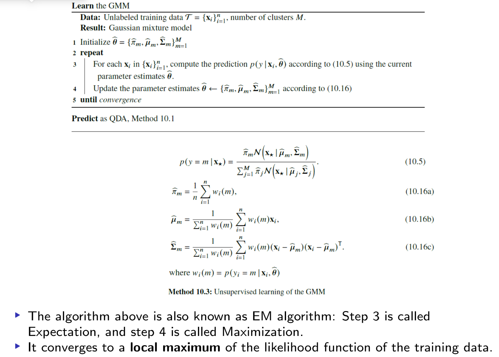
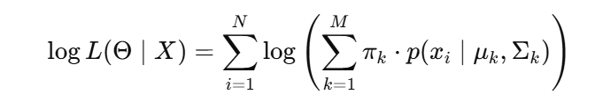

## Introduction / Statement of Contribution

This is the lab for bock2 in the Machine Learning. In this lab, contains
the following tasks:1. ENSEMBLE METHODS.2.MIXTURE MODELS.3. Theory.
Han Xia and Liuxi Mei was responsible for the code writing of assignment 1 and assignment 2 respectively, and Xiaochen Liu was mainly responsible for the answer of assignment 3. For each assignment, everyone participated in the problem analysis to ensure that everyone understood the final result.

```{r setup, include=FALSE}
Sys.setlocale("LC_ALL", "sv_SE.UTF-8")
options(repos = c(CRAN = "https://cran.r-project.org"))
```

## Assignment 1:ENSEMBLE METHODS

```{r include=FALSE}
install.packages("randomForest")
library(randomForest)
```

#build test data set

First of all, we fixed the data of the test set to avoid the result
error caused by the difference of the test set in the subsequent
calculation process.

```{r dataset}
set.seed(1234)
x1 <- runif(1000)
x2 <- runif(1000)
testdata <- cbind(x1, x2)
colnames(testdata) <- c("x1", "x2")
y1 <- as.numeric(x1 < x2)
testlabels <- as.factor(y1)
y2 <- as.numeric(x1 < 0.5)
testlabels2 <- as.factor(y2)
y3 <- as.numeric((x1<0.5 & x2<0.5) | (x1>0.5 & x2>0.5))
testlabels3 <- as.factor(y3)
```

<<<<<<< HEAD
#build the train dataset for 1000 times with the size of 100
We created 1000 training data sets of size 100 and fixed them, learn a random forest from
each data set.
```{r train dataset}
set.seed(123)
train_data_list <- lapply(1:1000, function(i) {
  x3 <- runif(100)
  x4 <- runif(100)
  trdata <- cbind(x3, x4)
  colnames(trdata) <- c("x1", "x2")
  list(trdata = trdata)
})
```

<<<<<<< HEAD
# Compute the misclassification error in the same test dataset
of size 1000 in condition 1. Report results for when the random forest has 1, 10 and
100 trees.

```{r include=FALSE}
error_rate_1<- list(
  number1 = rep(0,1000),
  number2 = rep(0,1000),
  number3 = rep(0,1000)
)
mean_error_1<- c()
var_error_1<- c()
for (i in 1:1000) {
  trdata <- train_data_list[[i]]$trdata
  y <- as.numeric(trdata[, 1] < trdata[, 2])
  trlabels <- as.factor(y)

  #build the models
  rf_model1 <- randomForest(trdata, trlabels, ntree = 1, nodesize = 25, keep.forest = TRUE)
  rf_model2 <- randomForest(trdata, trlabels, ntree = 10, nodesize = 25, keep.forest = TRUE)
  rf_model3 <- randomForest(trdata, trlabels, ntree = 100, nodesize = 25, keep.forest = TRUE)

  #predictions and error rates
  predictions1<- predict(rf_model1,testdata)
  error_rate_1$number1[i] <- mean(predictions1 != testlabels)
  predictions2<- predict(rf_model2,testdata)
  error_rate_1$number2[i] <- mean(predictions2 != testlabels)
  predictions3<- predict(rf_model3,testdata)
  error_rate_1$number3[i] <- mean(predictions3 != testlabels)

}
```

#compute the mean and variance of error rates

```{r include=FALSE}
mean_error_1[1]<- mean(error_rate_1$number1)
mean_error_1[2]<- mean(error_rate_1$number2)
mean_error_1[3]<- mean(error_rate_1$number3)

var_error_1[1] <- var(error_rate_1$number1)
var_error_1[2] <- var(error_rate_1$number2)
var_error_1[3] <- var(error_rate_1$number3)

```

Then, we can change the condition,and the calculation is the same as
before.

#Repeat for the conditions (x1\<0.5) for 1,10,100 trees, the results are
summarized in mean_error_2 and var_error_2.

```{r include=FALSE}
error_rate_2<- list(
  number1 = rep(0,1000),
  number2 = rep(0,1000),
  number3 = rep(0,1000)
)
mean_error_2<- c()
var_error_2<- c()
for (i in 1:1000) {
  trdata <- train_data_list[[i]]$trdata
  y <- as.numeric(trdata[, 1] < 0.5)
  trlabels <- as.factor(y)

  #build the models
  rf_model1 <- randomForest(trdata, trlabels, ntree = 1, nodesize = 25, keep.forest = TRUE)
  rf_model2 <- randomForest(trdata, trlabels, ntree = 10, nodesize = 25, keep.forest = TRUE)
  rf_model3 <- randomForest(trdata, trlabels, ntree = 100, nodesize = 25, keep.forest = TRUE)

  #predictions and error rates
  predictions1<- predict(rf_model1,testdata)
  error_rate_2$number1[i] <- mean(predictions1 != testlabels2)
  predictions2<- predict(rf_model2,testdata)
  error_rate_2$number2[i] <- mean(predictions2 != testlabels2)
  predictions3<- predict(rf_model3,testdata)
  error_rate_2$number3[i] <- mean(predictions3 != testlabels2)

}

```

```{r include=FALSE}
mean_error_2[1]<- mean(error_rate_2$number1)
mean_error_2[2]<- mean(error_rate_2$number2)
mean_error_2[3]<- mean(error_rate_2$number3)

var_error_2[1] <- var(error_rate_2$number1)
var_error_2[2] <- var(error_rate_2$number2)
var_error_2[3] <- var(error_rate_2$number3)

```

#Repeat for the conditions ((x1\<0.5 & x2\<0.5) \| (x1\>0.5 & x2\>0.5))
and node size 12 for 1,10,100 trees, the results are summarized in
mean_error_3 and var_error_3.

```{r include=FALSE}
error_rate_3<- list(
  number1 = rep(0,1000),
  number2 = rep(0,1000),
  number3 = rep(0,1000)
)
mean_error_3<- c()
var_error_3<- c()
for (i in 1:1000) {
  trdata <- train_data_list[[i]]$trdata
  y <- as.numeric((trdata[, 1] < 0.5 & trdata[, 2] < 0.5) | (trdata[, 1] > 0.5 & trdata[, 2] > 0.5))
  trlabels <- as.factor(y)

  #build the models
  rf_model1 <- randomForest(trdata, trlabels, ntree = 1, nodesize = 12, keep.forest = TRUE)
  rf_model2 <- randomForest(trdata, trlabels, ntree = 10, nodesize = 12, keep.forest = TRUE)
  rf_model3 <- randomForest(trdata, trlabels, ntree = 100, nodesize = 12, keep.forest = TRUE)

  #predictions and error rates
  predictions1<- predict(rf_model1,testdata)
  error_rate_3$number1[i] <- mean(predictions1 != testlabels3)
  predictions2<- predict(rf_model2,testdata)
  error_rate_3$number2[i] <- mean(predictions2 != testlabels3)
  predictions3<- predict(rf_model3,testdata)
  error_rate_3$number3[i] <- mean(predictions3 != testlabels3)

}

```

```{r include=FALSE}
mean_error_3[1]<- mean(error_rate_3$number1)
mean_error_3[2]<- mean(error_rate_3$number2)
mean_error_3[3]<- mean(error_rate_3$number3)

var_error_3[1] <- var(error_rate_3$number1)
var_error_3[2] <- var(error_rate_3$number2)
var_error_3[3] <- var(error_rate_3$number3)

```

#summary the results

```{r include=FALSE}
result<- list(
  mean_error_1 = mean_error_1,
  mean_error_2 = mean_error_2,
  mean_error_3 = mean_error_3,

  var_error_1 = var_error_1,
  var_error_2 = var_error_2,
  var_error_3 = var_error_3
)
print(result)
```

#### Questions:

#### What happens with the mean error rate when the number of trees in the random forest grows? Why?

As the number of trees in the random forest increases, the mean error
rate decreases. This happens because: a random forest combines multiple
decision trees. As more trees are added, the predictions are averaged,
reducing the variance of the model. With more trees, the random forest
effectively samples a larger variety of subsets from the training data.
This increases the likelihood that the model captures the true
underlying patterns.

#### The third data set represents a slightly more complicated classification problem than the first one. Still, you should get better performance for it when using sufficient trees in the random forest. Explain why you get better performance.

Despite being more complex, the random forest performs better on the
third data set with sufficient trees because: the third data set is more
complex and may contain multiple non-linear boundaries or classes that
are more difficult to distinguish. In this case, a single tree may not
be enough to capture all the complex patterns, and increasing the number
of trees can provide more decision rules, thereby improving the
performance of the model. More trees can improve the generalization
ability of the model in an integrated way.

## Assignment 2:MIXTURE MODELS

In this assignment,we will chose different values of M,and compare their
fit results.The E and M steps are calculated as follows:
 and the formula for calculating the
log-likelihood value is as follows:


```{r}
# Let's take K=3 for example
set.seed(1234567890)
max_it <- 100 # max number of EM iterations
min_change <- 0.1 # min change in log lik between two consecutive iterations
n=1000 # number of training points
D=10 # number of dimensions
x <- matrix(nrow=n, ncol=D) # training data
true_pi <- vector(length = 3) # true mixing coefficients
true_mu <- matrix(nrow=3, ncol=D) # true conditional distributions
true_pi=c(1/3, 1/3, 1/3)
true_mu[1,]=c(0.5,0.6,0.4,0.7,0.3,0.8,0.2,0.9,0.1,1)
true_mu[2,]=c(0.5,0.4,0.6,0.3,0.7,0.2,0.8,0.1,0.9,0)
true_mu[3,]=c(0.5,0.5,0.5,0.5,0.5,0.5,0.5,0.5,0.5,0.5)
plot(true_mu[1,], type="o", col="blue", ylim=c(0,1))
points(true_mu[2,], type="o", col="red")
points(true_mu[3,], type="o", col="green")
# Producing the training data
for(i in 1:n) {
  m <- sample(1:3,1,prob=true_pi)
  for(d in 1:D) {
    x[i,d] <- rbinom(1,1,true_mu[m,d])
  }
}
M=3 # number of clusters,it can be changed to 2 or 4
w <- matrix(nrow=n, ncol=M) # weights
pi <- vector(length = M) # mixing coefficients
mu <- matrix(nrow=M, ncol=D) # conditional distributions
llik <- vector(length = max_it) # log likelihood of the EM iterations
# Random initialization of the parameters
pi <- runif(M,0.49,0.51)
pi <- pi / sum(pi)
for(m in 1:M) {
  mu[m,] <- runif(D,0.49,0.51)
}
pi
mu
for(it in 1:max_it) {
  plot(mu[1,], type="o", col="blue", ylim=c(0,1))
  points(mu[2,], type="o", col="red")
  points(mu[3,], type="o", col="green")#This line should be ignored if K=2 
  #points(mu[4,], type="o", col="yellow")#This line should be ignored if K=2 or k=3
  Sys.sleep(0.5)
  
  # E-step: Computation of the weights
  for (i in 1:n) {
    for (m in 1:M) {
      numerator <- pi[m] * prod(mu[m, ]^x[i, ] * (1 - mu[m, ])^(1 - x[i, ]))
      denominator <- sum(sapply(1:M, function(k) {
        pi[k] * prod(mu[k, ]^x[i, ] * (1 - mu[k, ])^(1 - x[i, ]))
      }))
      w[i, m] <- numerator / denominator
    }
  }
#Log likelihood computation.
  llik[it] <- sum(sapply(1:n, function(i) {
    log(sum(sapply(1:M, function(m) {
      pi[m] * prod(mu[m, ]^x[i, ] * (1 - mu[m, ])^(1 - x[i, ]))
    })))
  }))

  cat("iteration: ", it, "log likelihood: ", llik[it], "\n")
  flush.console()
  
  # Stop if the log likelihood has not changed significantly
  if (it > 1 && abs(llik[it] - llik[it - 1]) < min_change) {
    cat("Converged at iteration", it, "\n")
    break
  }
  
  #M-step: ML parameter estimation from the data and weights
  for (m in 1:M) {
    pi[m] <- sum(w[, m]) / n
    for (d in 1:D) {
      mu[m, d] <- sum(w[, m] * x[, d]) / sum(w[, m])
    }
  }
}
pi
mu
plot(llik[1:it], type="o")
```

We can get results for different M values.When M is equal to 2, the
coefficient (pi) approaches 0.5, meaning that the two clusters
contribute nearly equally to the data. Although there are significant
differences in the conditional distribution (mu) on each dimension,there
is a big deviation from the true value, resulting in underfitting.When M
is equal to 3, the convergence rate is slightly slower than when M is
equal to 2, but the mu is more dispersed and closer to the true value,
which can accurately capture the true structure of the data without
being overly complicated.When M is equal to 4, the log-likelihood
converges at the 44th iteration, and the convergence speed is the
slowest, which indicates that the complexity of the model is
significantly increased, and the weight of some clusters (such as pi1
and pi2) is very small, which indicates that the data may be
unnecessarily split and overfitting may occur.

## Assignment 3:MIXTURE MODELS

-   In an ensemble model, is it true that the larger the number B of
    ensemble members the more flexible the ensemble model?

    -   No, more ensemble members does not make the resulting model more
        flexible but only reduces the variance.( page 169)

-   In AdaBoost, what is the loss function used to train the boosted
    classifier at each iteration?

    -   The loss fucntion is the exponential loss function below (page
        177): $$
         L(y \cdot f(x)) = \exp(-y \cdot f(x)) 
        $$

-   Sketch how you would use cross-validation to select the number of
    components (or clusters) in unsupervised learning of GMMs.

    -   Cluster number M is chosen when the benefit from choosing M+1
        clusters is insignificant. By looking into the case provided by
        course book, the objective drops significantly when the number
        of cluster increases from 1 to 4. But when it increases from 4
        to 5, the influence on objective is negligible. The 'bending
        point' is usually a good candidate of the cluster number. (Page
        267）

    
